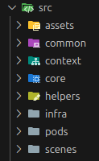

# e-Commerce Project

## Technology

This application uses the following key technologies:

- [Webpack 5](https://webpack.js.org)
- [React 18](https://es.react.dev)
- [Typescript 5](https://www.typescriptlang.org)
- [Storybook 8](https://storybook.js.org)
- [Sass](https://sass-lang.com)

* [Jest](https://jestjs.io)
* [React Testing Library](https://testing-library.com/docs)

## Description

This is an e-commerce application with three available views: List, Details and Checkout.
It allows the users to list mobile phones catalog, access to see its specifications and add them to the cart.

Features included:

- Debounced search to minimize the amount of api calls.
- Cart stored in the browser local storage.
- Use of context in order to have the cart information available along the application.
- Responsive design.

* Webpack configuration in order to manage Production and Development modes.

Future improvements:

- Integrate [React Query](https://tanstack.com) to mange cache and api calls.
- implement accessibility practices.
- Increase test coverage.

## Setup

### Install dependencies

Run the next command in order to intall all the package.json dependencies:

```
npm intall
```

### Available scripts

Start the application in development and production modes respectively:

```
start:dev
start:prod
```

Build the application in development and production modes respectively:

```
build:dev
build:prod
```

Execute the tests and test coverage respectively:

```
test
test:coverage
```

Stary storybook

```
storybook
```

## Architecture

Project structure



The architecture decisions were made in orde to have a clean, robust and scalable solution, following
an atomic design. The directory structure was build following the [Lemoncode](https://github.com/Lemoncode/lemon-front-estructura/blob/main/guia-lemon-front_v0_1_2.pdf) guide.

## Deploy

This application has been deployed in [Netlify](https://www.netlify.com)

Access by this [Link ](https://e-commerce-ycortes.netlify.app)
